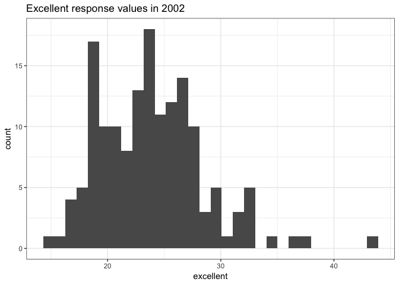
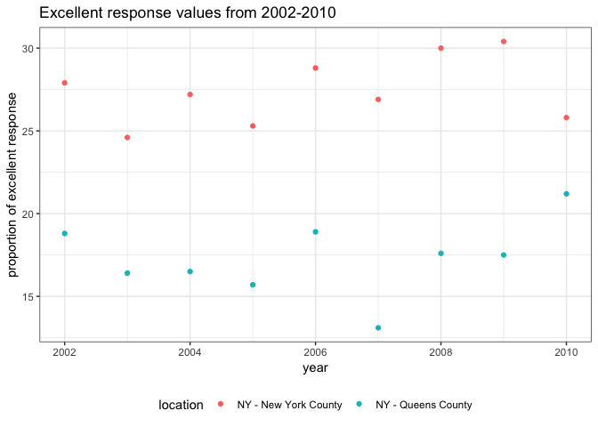

p8105 homework2
================
Shuwei Liu sl4471
2018-10-03

Problem 1
=========

1.1 Import data
---------------

``` r
subway_df = 
  read_csv("./data/NYC_Transit_Subway_Entrance_And_Exit_Data.csv") %>% 
  janitor::clean_names() %>% 
  select(line, station_name, station_latitude, station_longitude, starts_with("route"), entry,
         vending, entrance_type, ada) %>% 
  mutate(entry = recode(entry, `YES` = TRUE, `NO` = FALSE))
```

    ## Parsed with column specification:
    ## cols(
    ##   .default = col_character(),
    ##   `Station Latitude` = col_double(),
    ##   `Station Longitude` = col_double(),
    ##   Route8 = col_integer(),
    ##   Route9 = col_integer(),
    ##   Route10 = col_integer(),
    ##   Route11 = col_integer(),
    ##   ADA = col_logical(),
    ##   `Free Crossover` = col_logical(),
    ##   `Entrance Latitude` = col_double(),
    ##   `Entrance Longitude` = col_double()
    ## )

    ## See spec(...) for full column specifications.

``` r
subway_df
```

    ## # A tibble: 1,868 x 19
    ##    line  station_name station_latitude station_longitu… route1 route2
    ##    <chr> <chr>                   <dbl>            <dbl> <chr>  <chr> 
    ##  1 4 Av… 25th St                  40.7            -74.0 R      <NA>  
    ##  2 4 Av… 25th St                  40.7            -74.0 R      <NA>  
    ##  3 4 Av… 36th St                  40.7            -74.0 N      R     
    ##  4 4 Av… 36th St                  40.7            -74.0 N      R     
    ##  5 4 Av… 36th St                  40.7            -74.0 N      R     
    ##  6 4 Av… 45th St                  40.6            -74.0 R      <NA>  
    ##  7 4 Av… 45th St                  40.6            -74.0 R      <NA>  
    ##  8 4 Av… 45th St                  40.6            -74.0 R      <NA>  
    ##  9 4 Av… 45th St                  40.6            -74.0 R      <NA>  
    ## 10 4 Av… 53rd St                  40.6            -74.0 R      <NA>  
    ## # ... with 1,858 more rows, and 13 more variables: route3 <chr>,
    ## #   route4 <chr>, route5 <chr>, route6 <chr>, route7 <chr>, route8 <int>,
    ## #   route9 <int>, route10 <int>, route11 <int>, entry <lgl>,
    ## #   vending <chr>, entrance_type <chr>, ada <lgl>

1.2 Describe the data
---------------------

``` r
variable.names(subway_df)
```

    ##  [1] "line"              "station_name"      "station_latitude" 
    ##  [4] "station_longitude" "route1"            "route2"           
    ##  [7] "route3"            "route4"            "route5"           
    ## [10] "route6"            "route7"            "route8"           
    ## [13] "route9"            "route10"           "route11"          
    ## [16] "entry"             "vending"           "entrance_type"    
    ## [19] "ada"

``` r
dim(subway_df)
```

    ## [1] 1868   19

This 1868 rows\*19 columns data frame contains 19 variables, including "line", "station name", "station latitidu", "station longitude", "route1"-"route11", "entry", "vending", "entrance type", "ada" and "ada notes". After reading files, I use "janitor::clean\_names()" to clean up variable names and covert them to lower snake case. And then, applying "select" function to choose the column I want. Finally, "mutate" function is used to convert the entry variable to a logical one. However, this data frame is not tidy yet. The different route numbers make it difficult to read.

``` r
count(distinct(subway_df, line, station_name))
```

    ## # A tibble: 1 x 1
    ##       n
    ##   <int>
    ## 1   465

``` r
ada_data = filter(subway_df, ada == TRUE)
count(distinct(ada_data, line, station_name))
```

    ## # A tibble: 1 x 1
    ##       n
    ##   <int>
    ## 1    84

``` r
without_vending = filter(subway_df, vending == "NO")
sum(without_vending$entry == TRUE)/length(without_vending$entry)
```

    ## [1] 0.3770492

As above, there are 465 distinct stations, and 84 of them are ADA compliant. About 37.7% of station entrances / exits do not have vending allow entrance.

1.3 Reformat the data
---------------------

``` r
subway_tidy = 
  gather(subway_df, key = "route_number", value = "route_name", route1:route11)
subway_tidy
```

    ## # A tibble: 20,548 x 10
    ##    line  station_name station_latitude station_longitu… entry vending
    ##    <chr> <chr>                   <dbl>            <dbl> <lgl> <chr>  
    ##  1 4 Av… 25th St                  40.7            -74.0 TRUE  YES    
    ##  2 4 Av… 25th St                  40.7            -74.0 TRUE  YES    
    ##  3 4 Av… 36th St                  40.7            -74.0 TRUE  YES    
    ##  4 4 Av… 36th St                  40.7            -74.0 TRUE  YES    
    ##  5 4 Av… 36th St                  40.7            -74.0 TRUE  YES    
    ##  6 4 Av… 45th St                  40.6            -74.0 TRUE  YES    
    ##  7 4 Av… 45th St                  40.6            -74.0 TRUE  YES    
    ##  8 4 Av… 45th St                  40.6            -74.0 TRUE  YES    
    ##  9 4 Av… 45th St                  40.6            -74.0 TRUE  YES    
    ## 10 4 Av… 53rd St                  40.6            -74.0 TRUE  YES    
    ## # ... with 20,538 more rows, and 4 more variables: entrance_type <chr>,
    ## #   ada <lgl>, route_number <chr>, route_name <chr>

Now, the route number and the route name are two distinct variables.

``` r
A_line = filter(subway_tidy, route_name == "A") %>% 
  distinct(line, station_name, ada)
nrow(A_line)
```

    ## [1] 60

``` r
count(A_line, ada == "TRUE")
```

    ## # A tibble: 2 x 2
    ##   `ada == "TRUE"`     n
    ##   <lgl>           <int>
    ## 1 FALSE              43
    ## 2 TRUE               17

Obviously, there are 60 stations that serve A line and 17 of them are ADA compliant.

Problem 2
=========

2.1 Import data of MR.Trash Wheel
---------------------------------

``` r
wheel_df = 
  readxl::read_excel("./data/HealthyHarborWaterWheelTotals2018-7-28.xlsx", 
                     sheet = 1, range = "A2:N338") %>% 
  janitor::clean_names() %>% 
  filter(!is.na(dumpster)) %>% 
  mutate(sports_balls = as.integer(round(sports_balls)))
wheel_df
```

    ## # A tibble: 285 x 14
    ##    dumpster month  year date                weight_tons volume_cubic_ya…
    ##       <dbl> <chr> <dbl> <dttm>                    <dbl>            <dbl>
    ##  1        1 May    2014 2014-05-16 00:00:00        4.31               18
    ##  2        2 May    2014 2014-05-16 00:00:00        2.74               13
    ##  3        3 May    2014 2014-05-16 00:00:00        3.45               15
    ##  4        4 May    2014 2014-05-17 00:00:00        3.1                15
    ##  5        5 May    2014 2014-05-17 00:00:00        4.06               18
    ##  6        6 May    2014 2014-05-20 00:00:00        2.71               13
    ##  7        7 May    2014 2014-05-21 00:00:00        1.91                8
    ##  8        8 May    2014 2014-05-28 00:00:00        3.7                16
    ##  9        9 June   2014 2014-06-05 00:00:00        2.52               14
    ## 10       10 June   2014 2014-06-11 00:00:00        3.76               18
    ## # ... with 275 more rows, and 8 more variables: plastic_bottles <dbl>,
    ## #   polystyrene <dbl>, cigarette_butts <dbl>, glass_bottles <dbl>,
    ## #   grocery_bags <dbl>, chip_bags <dbl>, sports_balls <int>,
    ## #   homes_powered <dbl>

2.2 Import precipitation data
-----------------------------

``` r
precipitation_2016 = 
  readxl::read_excel("./data/HealthyHarborWaterWheelTotals2018-7-28.xlsx", 
                     sheet = 5, range = "A2:B14") %>% 
  janitor::clean_names() %>% 
  filter(!is.na(total)) %>% 
  mutate(year = "2016") %>% 
  select(year, everything())

precipitation_2017 = 
  readxl::read_excel("./data/HealthyHarborWaterWheelTotals2018-7-28.xlsx", 
                     sheet = 4, range = "A2:B14") %>% 
  janitor::clean_names() %>% 
  filter(!is.na(total)) %>% 
  mutate(year = "2017") %>% 
  select(year, everything())

precipitation_df = 
  bind_rows(precipitation_2016, precipitation_2017) %>%
  mutate(month = month.name[month])
precipitation_df
```

    ## # A tibble: 24 x 3
    ##    year  month     total
    ##    <chr> <chr>     <dbl>
    ##  1 2016  January    3.23
    ##  2 2016  February   5.32
    ##  3 2016  March      2.24
    ##  4 2016  April      1.78
    ##  5 2016  May        5.19
    ##  6 2016  June       3.2 
    ##  7 2016  July       6.09
    ##  8 2016  August     3.96
    ##  9 2016  September  4.53
    ## 10 2016  October    0.62
    ## # ... with 14 more rows

2.3 Data description
--------------------

``` r
wheel_2016 = 
  filter(wheel_df, year == 2016) 
```

The "wheel\_df" tells us different kinds of trash in dumsters from year 2014-2018. It contains 285 observations with 14 variables. The key variable here is "dumpster".

The "precipitation\_df" tells us the precipitation of every month in 2016-2017. It contains 24 observations with 3 variables. The key variable here is "year".

From the data, we can observe that the total precipitation in 2017 is 32.93. The median number of sports balls in a dumpster in 2016 is 26.

Problem 3
=========

3.1 Import data
---------------

``` r
devtools::install_github("p8105/p8105.datasets")
```

    ## Skipping install of 'p8105.datasets' from a github remote, the SHA1 (21f5ad1c) has not changed since last install.
    ##   Use `force = TRUE` to force installation

``` r
library(p8105.datasets)
data("brfss_smart2010")
overall_health_data = 
  janitor::clean_names(brfss_smart2010) %>% 
  filter(topic == "Overall Health") %>% 
  select(-"class", -"topic", -"question", -"sample_size",
         -"confidence_limit_low":-"geo_location") %>% 
  spread(key = "response", value = data_value) %>% 
  janitor::clean_names() %>% 
  select(year, locationabbr, locationdesc, excellent, very_good, good, fair, poor) %>% 
  mutate(proportion = (excellent + very_good))
overall_health_data
```

    ## # A tibble: 2,125 x 9
    ##     year locationabbr locationdesc excellent very_good  good  fair  poor
    ##    <int> <chr>        <chr>            <dbl>     <dbl> <dbl> <dbl> <dbl>
    ##  1  2002 AK           AK - Anchor…      27.9      33.7  23.8   8.6   5.9
    ##  2  2002 AL           AL - Jeffer…      18.5      30.9  32.7  12.1   5.9
    ##  3  2002 AR           AR - Pulask…      24.1      29.3  29.9  12.5   4.2
    ##  4  2002 AZ           AZ - Marico…      21.6      36.6  26.9  10.3   4.6
    ##  5  2002 AZ           AZ - Pima C…      26.6      30.1  31.9   7.5   3.9
    ##  6  2002 CA           CA - Los An…      22.7      29.8  28.7  14.3   4.5
    ##  7  2002 CO           CO - Adams …      21.2      31.2  29    14.4   4.2
    ##  8  2002 CO           CO - Arapah…      25.5      35.2  29.3   8     2.1
    ##  9  2002 CO           CO - Denver…      22.2      27.1  36.6  11.1   3  
    ## 10  2002 CO           CO - Jeffer…      23.4      36.6  26.3  11.4   2.4
    ## # ... with 2,115 more rows, and 1 more variable: proportion <dbl>

3.2 An optional data frame
--------------------------

Kindly reminder: we are not asked to do this part.

According to the instructions of problem3, a data frame has been created. However, in my opinion, it is not reader-friendly. The "locationdesc" column repeat the "locationabbr" content. Therefore, I use another approach to modify it as below although it may not be necessary.

``` r
overall_health_data0 = 
  janitor::clean_names(brfss_smart2010) %>% 
  filter(topic == "Overall Health") %>% 
  select(-"class", -"topic", -"question", -"sample_size",
         -"confidence_limit_low":-"geo_location") %>% 
  rename(state = locationabbr, location = locationdesc) %>% 
  separate(location, into = c("stateabbr", "location"), "- ") %>% 
  spread(key = "response", value = data_value) %>% 
  janitor::clean_names() %>% 
  select(year, state, location, excellent, very_good, good, fair, poor) %>% 
  mutate(proportion = (excellent + very_good))
overall_health_data0
```

    ## # A tibble: 2,125 x 9
    ##     year state location   excellent very_good  good  fair  poor proportion
    ##    <int> <chr> <chr>          <dbl>     <dbl> <dbl> <dbl> <dbl>      <dbl>
    ##  1  2002 AK    Anchorage…      27.9      33.7  23.8   8.6   5.9       61.6
    ##  2  2002 AL    Jefferson…      18.5      30.9  32.7  12.1   5.9       49.4
    ##  3  2002 AR    Pulaski C…      24.1      29.3  29.9  12.5   4.2       53.4
    ##  4  2002 AZ    Maricopa …      21.6      36.6  26.9  10.3   4.6       58.2
    ##  5  2002 AZ    Pima Coun…      26.6      30.1  31.9   7.5   3.9       56.7
    ##  6  2002 CA    Los Angel…      22.7      29.8  28.7  14.3   4.5       52.5
    ##  7  2002 CO    Adams Cou…      21.2      31.2  29    14.4   4.2       52.4
    ##  8  2002 CO    Arapahoe …      25.5      35.2  29.3   8     2.1       60.7
    ##  9  2002 CO    Denver Co…      22.2      27.1  36.6  11.1   3         49.3
    ## 10  2002 CO    Jefferson…      23.4      36.6  26.3  11.4   2.4       60  
    ## # ... with 2,115 more rows

3.3 Description of location
---------------------------

``` r
nrow(distinct(overall_health_data, locationabbr, locationdesc))
```

    ## [1] 404

``` r
nrow(distinct(overall_health_data, locationabbr))
```

    ## [1] 51

``` r
state_df = count(overall_health_data, locationabbr) %>% 
  arrange(desc(n))
state_df
```

    ## # A tibble: 51 x 2
    ##    locationabbr     n
    ##    <chr>        <int>
    ##  1 NJ             146
    ##  2 FL             122
    ##  3 NC             115
    ##  4 WA              97
    ##  5 MD              90
    ##  6 MA              79
    ##  7 TX              71
    ##  8 NY              65
    ##  9 SC              63
    ## 10 CO              59
    ## # ... with 41 more rows

As above, there are 404 unique locations in the dataset. Every state is presented, including Washington D.C. and 50 states of US. Among them, New Jersey has been observed the most with 142 observations.

3.4 Take median
---------------

``` r
data_2002 = 
  filter(overall_health_data, year == 2002, !is.na(excellent))
```

In 2002, the median of the "Excellent" response value is 23.6.

3.5 Make plots
--------------

First, this plot shows the "Excellent" response values in the year 2002.

``` r
ggplot(data_2002, aes(x = excellent)) + 
  geom_histogram() +
  labs(
    title = "Excellent response values in 2002"
    ) +
  theme_bw()
```

    ## `stat_bin()` using `bins = 30`. Pick better value with `binwidth`.



Then, this is a scatterplot showing the proportion of "Excellent" response values in New York County and Queens County in each year from 2002 to 2010.

``` r
NY_data = 
  rename(overall_health_data, location = locationdesc) %>% 
  filter(location == "NY - New York County" | location == "NY - Queens County")

ggplot(NY_data, aes(x = year, y = excellent, color = location)) + 
  geom_point() +
  labs(
    title = "Excellent response values from 2002-2010",
    x = "year",
    y = "proportion of excellent response"
    ) +
  theme_bw() +
  theme(legend.position = "bottom")
```


