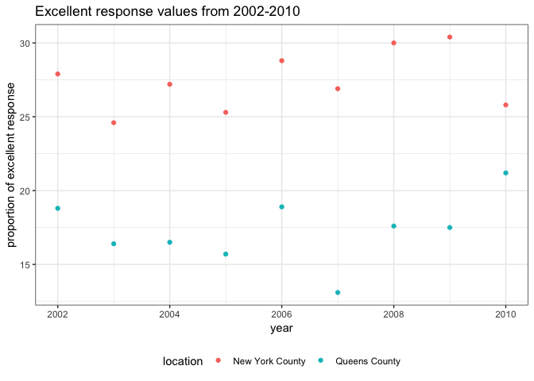

p8105 homework2
================
Shuwei Liu sl4471
2018-10-03

Problem 1
=========

1.1 Import data
---------------

``` r
subway_df = 
  read_csv("./data/NYC_Transit_Subway_Entrance_And_Exit_Data.csv") %>% 
  janitor::clean_names() %>% 
  select(line, station_name, station_latitude, station_longitude, starts_with("route"), entry,
         vending, entrance_type, starts_with("ada")) %>% 
  mutate(entry = recode(entry, `YES` = TRUE, `NO` = FALSE))
```

    ## Parsed with column specification:
    ## cols(
    ##   .default = col_character(),
    ##   `Station Latitude` = col_double(),
    ##   `Station Longitude` = col_double(),
    ##   Route8 = col_integer(),
    ##   Route9 = col_integer(),
    ##   Route10 = col_integer(),
    ##   Route11 = col_integer(),
    ##   ADA = col_logical(),
    ##   `Free Crossover` = col_logical(),
    ##   `Entrance Latitude` = col_double(),
    ##   `Entrance Longitude` = col_double()
    ## )

    ## See spec(...) for full column specifications.

1.2 Describe the data
---------------------

``` r
variable.names(subway_df)
```

    ##  [1] "line"              "station_name"      "station_latitude" 
    ##  [4] "station_longitude" "route1"            "route2"           
    ##  [7] "route3"            "route4"            "route5"           
    ## [10] "route6"            "route7"            "route8"           
    ## [13] "route9"            "route10"           "route11"          
    ## [16] "entry"             "vending"           "entrance_type"    
    ## [19] "ada"               "ada_notes"

``` r
dim(subway_df)
```

    ## [1] 1868   20

This 1868 rows\*20 columns data frame contains 20 variables, including "line", "station name", "station latitidu", "station longitude", "route1"-"route11", "entry", "vending", "entrance type", "ada" and "ada notes". After reading files, I use "janitor::clean\_names()" to clean up variable names and covert them to lower snake case. And then, applying "select" function to choose the column I want. Finally, "mutate" function is used to convert the entry variable to a logical one. However, this data frame is not tidy yet. The different route numbers make it difficult to read.

``` r
count(distinct(subway_df, line, station_name))
```

    ## # A tibble: 1 x 1
    ##       n
    ##   <int>
    ## 1   465

``` r
ada_data = filter(subway_df, ada == TRUE)
count(distinct(ada_data, line, station_name))
```

    ## # A tibble: 1 x 1
    ##       n
    ##   <int>
    ## 1    84

``` r
without_vending = filter(subway_df, vending == "NO")
sum(without_vending$entry == TRUE)/length(without_vending$entry)
```

    ## [1] 0.3770492

As above, there are 465 distinct stations, and 84 of them are ADA compliant. About 37.7% of station entrances / exits do not have vending allow entrance.

1.3 Reformat the data
---------------------

``` r
subway_tidy = 
  gather(subway_df, key = "route_number", value = "route_name", route1:route11)

A_line = filter(subway_tidy, route_name == "A") %>% 
  distinct(line, station_name, ada)
nrow(A_line)
```

    ## [1] 60

``` r
count(A_line, ada == "TRUE")
```

    ## # A tibble: 2 x 2
    ##   `ada == "TRUE"`     n
    ##   <lgl>           <int>
    ## 1 FALSE              43
    ## 2 TRUE               17

Obviously, there are 60 stations that serve A line and 17 of them are ADA compliant.

Problem 2
=========

``` r
wheel_df = 
  readxl::read_excel("./data/HealthyHarborWaterWheelTotals2018-7-28.xlsx", 
                     sheet = 1, range = "A2:N338") %>% 
  janitor::clean_names() %>% 
  filter(!is.na(dumpster)) %>% 
  mutate(sports_balls = as.integer(round(sports_balls)))
```

``` r
precipitation_2016 = 
  readxl::read_excel("./data/HealthyHarborWaterWheelTotals2018-7-28.xlsx", 
                     sheet = 5, range = "A2:B15") %>% 
  janitor::clean_names() %>% 
  filter(!is.na(total)) %>% 
  mutate(year = "2016") %>% 
  select(year, everything())


precipitation_2017 = 
  readxl::read_excel("./data/HealthyHarborWaterWheelTotals2018-7-28.xlsx", 
                     sheet = 4, range = "A2:B15") %>% 
  janitor::clean_names() %>% 
  filter(!is.na(total)) %>% 
  mutate(year = "2017") %>% 
  select(year, everything())

precipitation_df = 
  bind_rows(precipitation_2016, precipitation_2017) %>%
  mutate(month = month.name[month])
```

The Mr.wheel data contains different kinds of

``` r
wheel_2016 = 
  filter(wheel_df, year == 2016) %>% 
  mutate(sports_balls = as.numeric(sports_balls))
median(wheel_2016$sports_balls)
```

    ## [1] 26

Problem 3
=========

``` r
devtools::install_github("p8105/p8105.datasets")
```

    ## Skipping install of 'p8105.datasets' from a github remote, the SHA1 (21f5ad1c) has not changed since last install.
    ##   Use `force = TRUE` to force installation

``` r
library(p8105.datasets)
data("brfss_smart2010")
overall_health_data0 = 
  janitor::clean_names(brfss_smart2010) %>% 
  filter(topic == "Overall Health") %>% 
  select(-"class", -"topic", -"question", -"sample_size",
         -"confidence_limit_low":-"geo_location") %>% 
  spread(key = "response", value = data_value) %>% 
  janitor::clean_names() %>% 
  select(year, locationabbr, locationdesc, excellent, very_good, good, fair, poor) %>% 
  mutate(proportion = (excellent + very_good))
```

According to the instructions of problem3, a data frame has been created. However, in my opinion, it is not reader-friendly. I use another approach to modify it as below although we are not asked to do so since I suppose it is also important to make it more readable.

``` r
overall_health_data = 
  janitor::clean_names(brfss_smart2010) %>% 
  filter(topic == "Overall Health") %>% 
  select(-"class", -"topic", -"question", -"sample_size",
         -"confidence_limit_low":-"geo_location") %>% 
  rename(state = locationabbr, location = locationdesc) %>% 
  separate(location, into = c("stateabbr", "location"), "- ") %>% 
  spread(key = "response", value = data_value) %>% 
  janitor::clean_names() %>% 
  select(year, state, location, excellent, very_good, good, fair, poor) %>% 
  mutate(proportion = (excellent + very_good))
```

``` r
nrow(distinct(overall_health_data, location))
```

    ## [1] 351

``` r
nrow(distinct(overall_health_data, state))
```

    ## [1] 51

``` r
data = count(overall_health_data,state) %>% 
  arrange(desc(n)) 
```

``` r
data_2002 = 
  filter(overall_health_data, year == 2002, !is.na(excellent))
median(data_2002$excellent)
```

    ## [1] 23.6

``` r
ggplot(data_2002, aes(x = excellent)) + 
  geom_histogram() +
  labs(
    title = "Excellent response values in 2002"
    )
```

    ## `stat_bin()` using `bins = 30`. Pick better value with `binwidth`.


``` r
NY_data = 
  filter(overall_health_data, location == "New York County" | location == "Queens County")
ggplot(NY_data, aes(x = year, y = excellent, color = location)) + 
  geom_point() +
  labs(
    title = "Excellent response values from 2002-2010",
    x = "year",
    y = "proportion of excellent response"
    ) +
  theme_bw() +
  theme(legend.position = "bottom")
```


